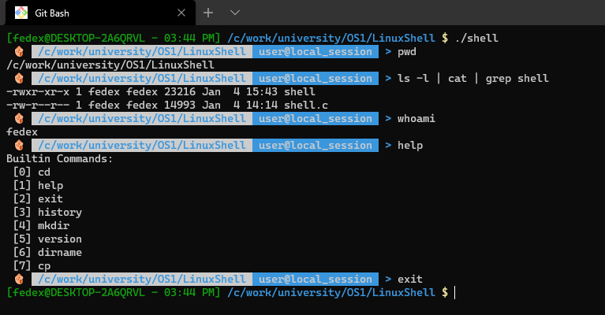
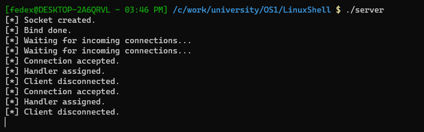
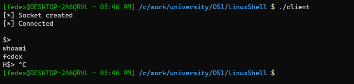
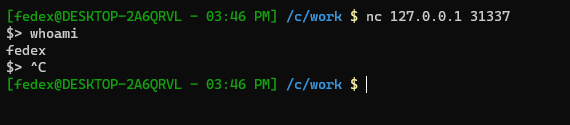

# LinuxShell
A basic implementation of the __Linux Shell__ in __C__

## Features
- Custom implementation of the following commands:
    * `cd` : change directory
    * `mkdir` : make directories
    * `dirname` : strip last component from file name
    * `cp` : copy files and directories (support for: `-virt`)
    * `mv` : move (rename) files (support for: `-itS`)
    * `exit` : cause normal process termination
    * `help` : display command information
    * `version` : display shell version
    * `history` : display command history

- Support for:
    * `pipes` ( "`|`" )
    * `redirection` ( "`>`", "`>>`" ) 
    * any number of `remote connections` ( "`server.c`" )

## Preview
- 
- 
- 
- 
